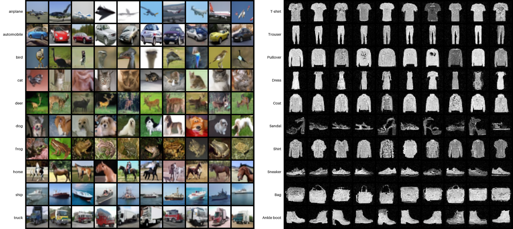

# DiT + Flow Matching on FashionMNIST & CIFAR-10

Class-conditional image generation with a **Diffusion Transformer**, trained
from scratch.

A reproduction of the DiT architecture
([Peebles & Xie, 2022](https://arxiv.org/abs/2212.09748)), trained with a
**conditional flow-matching** objective
([Lipman et al., 2023](https://arxiv.org/abs/2210.02747)) instead of the
original DDPM noise prediction. Pixel-space 32x32, no VAE, runs on a single GPU.
The same model handles grayscale FashionMNIST and RGB CIFAR-10 via `--dataset`.



*Class-conditional samples, one row per class. Left: CIFAR-10 (~32M-param DiT,
600 epochs). Right: FashionMNIST (~10M-param DiT, 120 epochs). Classifier-free
guidance scale 2.0, 50 sampling steps.*

## Quickstart

```bash
git clone https://github.com/YannickGibson/dit-flow-matching.git && cd dit-flow-matching
uv sync                                    # creates .venv and installs everything

uv run python train.py --dataset fashionmnist           # ~2-4h on one A100
uv run python train.py --dataset cifar10 --epochs 600    # scaled-up DiT, longer run
uv run python train.py --dataset cifar10 --wandb         # with live W&B tracking
uv run python sample.py --dataset cifar10                # labeled sample grid
uv run python fid.py --dataset cifar10                   # FID vs. the test set
uv run python ablation.py --dataset cifar10              # ablation tables
```

No `uv`? Fall back to `pip install -r requirements.txt` then drop the
`uv run` prefix.

## Datasets

| Dataset | Channels | DiT size | Params |
|---|---|---|---|
| `fashionmnist` | 1 (grayscale) | depth 8, hidden 256 | ~10M |
| `cifar10` | 3 (RGB) | depth 12, hidden 384 | ~32M |

CIFAR-10 is visually richer and harder, so the DiT is scaled up for it. Both
configs live in `data_utils.py`.

## What's in here

| File | Purpose |
|---|---|
| `model.py` | DiT - patchify, transformer blocks with **adaLN-zero**, linear head |
| `flow.py` | Flow-matching loss + Euler ODE sampler with classifier-free guidance |
| `data_utils.py` | Per-dataset configs, transforms, and loaders |
| `train.py` | Training loop (mixed precision, EMA); writes sample grids per epoch |
| `sample.py` | Generate a labeled class-conditional grid from a checkpoint |
| `grid.py` | Renders the labeled sample grid (class names beside each row) |
| `fid.py` | FID evaluation; `compute_fid()` is reusable |
| `ablation.py` | FID vs. guidance scale and vs. sampling steps |

The `slurm/` folder holds example SLURM batch scripts - adapt the `#SBATCH`
directives to your scheduler, or ignore them and run the `uv run` commands
directly.

## How it works

**DiT.** The image is split into 2x2 patches (256 tokens) and processed by a
transformer. Timestep and class are summed into a conditioning vector `c`;
each block derives shift/scale/gate parameters from `c` (**adaLN-zero**). The
gate projection is zero-initialized, so every block starts as an identity map
and the network eases into using conditioning during training.

**Flow matching.** Along the linear path `x_t = (1-t)*noise + t*data`, the
ideal velocity is the constant `data - noise`. The network regresses it with
plain MSE. Sampling integrates `dx/dt = v(x, t)` from noise (`t=0`) to data
(`t=1`), far fewer steps than DDPM.

**Classifier-free guidance.** The class label is dropped 10% of the time in
training; at sampling, the conditional and unconditional velocities are
extrapolated to sharpen class identity.

## Experiment tracking

Pass `--wandb` to `train.py` to log loss, learning rate, and per-epoch sample
grids to [Weights & Biases](https://wandb.ai). Without the flag, training runs
exactly as before (no account needed).

Live dashboard:
[wandb.ai/.../dit-fashionmnist](https://wandb.ai/gibson-yannick-czech-technical-university-in-prague/dit-fashionmnist/runs/3hj4jp48)

## Results

### FashionMNIST

Trained 120 epochs on one A100. FID computed over 5,000 generated images vs.
the test set.

| cfg scale (50 steps) | FID | | Euler steps (cfg 2.0) | FID |
|---|---|---|---|---|
| 1.0 | 92.34 | | 10 | 75.53 |
| 2.0 | 74.48 | | 50 | 74.07 |
| 4.0 | 70.93 | | 250 | 80.44 |

**Takeaways**
- Classifier-free guidance helps monotonically - FID drops from 92.3 (unguided)
  to 70.9 at scale 4.0.
- Sample quality is flat from 10 to 50 steps and does *not* improve at 250.
  Flow matching's near-straight probability paths are well approximated by a
  coarse Euler integrator, so ~50 steps is the sweet spot - a concrete
  advantage over DDPM's hundreds of steps.
- Absolute FID is high because the Inception feature extractor expects RGB
  natural images, while these are grayscale clothing - a domain mismatch that
  inflates the score. The **relative trends** are the informative part.

### CIFAR-10

Scaled-up DiT (~32M params) trained 600 epochs on one A100. FID computed over
5,000 generated images vs. the test set.

| cfg scale (50 steps) | FID | | Euler steps (cfg 2.0) | FID |
|---|---|---|---|---|
| 1.0 | 19.14 | | 10 | 23.27 |
| 2.0 | 15.98 | | 50 | 15.79 |
| 4.0 | 27.21 | | 250 | 14.64 |

**Takeaways**
- Guidance has a sweet spot at scale ~2.0. Unlike FashionMNIST, pushing to
  scale 4.0 *hurts* FID (15.98 -> 27.21): strong guidance trades sample
  diversity for per-image fidelity, and FID penalizes the lost diversity.
- More sampling steps help here - FID improves from 23.3 (10 steps) to 14.6
  (250), with 50 steps already capturing most of the gain. The harder RGB
  distribution benefits from finer ODE integration than FashionMNIST did.
- Best FID **14.64**. CIFAR-10 is RGB natural imagery, so unlike the
  FashionMNIST score this is a meaningful number - a solid result for a
  from-scratch, pixel-space model with no VAE.

## Scope notes

The original DiT runs in a VAE latent space on ImageNet; this is a smaller,
pixel-space reproduction. The backbones are intentionally modest to fit
single-GPU training runs.

## License

[MIT](LICENSE) (c) 2026 Yannick Gibson
